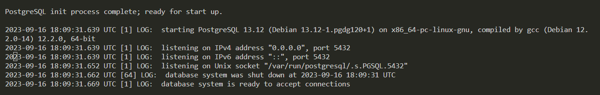

## Useful commands

 - Quickly create modules using the CLI, like a user module:

 `nest g module user`

 - Start the DB using docker:

 `docker compose up dev-db -d`

 After it runs you can check it with:

 `docker ps`

 Copy the container id and check the logs with:

 `docker logs <id>`

 

## Prisma

Prisma is an ORM (Object relation mapper)

We have installed the Prisma extension to get proper formatting

To initialize a prisma schema file, we run:

`npx prisma init`

Then after defining our schema, we can generate these tables in our DB (as long as it's already running in DOCKER)

`npx prisma migrate dev`

We can run a command to open the Prisma Studio to browse through our data:

`npx prisma studio`

## Accesing data from the request

Nest js gives us the option to reference the underlying Express variables, like Request:

```
  @Post('signup')
  signup(@Req() req: Request) {
    console.log(req.body);
    return this.authService.signup();
  }
```


## Description

[Nest](https://github.com/nestjs/nest) framework TypeScript starter repository.

## Installation

```bash
$ yarn install
```

## Running the app

```bash
# development
$ yarn run start

# watch mode
$ yarn run start:dev

# production mode
$ yarn run start:prod
```

## Test

```bash
# unit tests
$ yarn run test

# e2e tests
$ yarn run test:e2e

# test coverage
$ yarn run test:cov
```

## Support

Nest is an MIT-licensed open source project. It can grow thanks to the sponsors and support by the amazing backers. If you'd like to join them, please [read more here](https://docs.nestjs.com/support).

## Stay in touch

- Author - [Kamil Myśliwiec](https://kamilmysliwiec.com)
- Website - [https://nestjs.com](https://nestjs.com/)
- Twitter - [@nestframework](https://twitter.com/nestframework)

## License

Nest is [MIT licensed](LICENSE).
